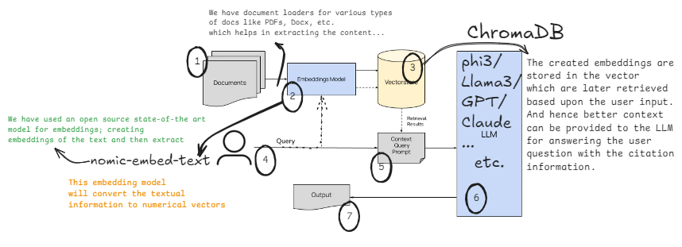

# Python GenAI Developer Training

## Other repo
> https://github.com/KirkYagami/ps2-genai-trng

----

## Colab Notebooks:

1. GenAI Basics: https://colab.research.google.com/drive/1hYDYolb7iMcQ9ERCE67LviBaOHbWBYw5?usp=sharing

---

## Hugging Face
### Suggested Readings (Not in order):
1. YT Tutorials:
    - https://youtu.be/QEaBAZQCtwE
    - https://www.youtube.com/watch?v=3kRB2TXewus

---

## Prompt Engg
### Suggested Readings (Not in order):

1. System Message:
- https://www.prompthub.us/blog/everything-system-messages-how-to-use-them-real-world-experiments-prompt-injection-protectors
- https://medium.com/data-science-in-your-pocket/claudes-system-prompt-explained-d9b7989c38a3

---

## RAG

### Suggested Readings (Not in order):

- Langchain Rag Tutorial: https://medium.com/@dminhk/retrieval-augmented-generation-rag-explained-b1dd89979681

- https://www.datacamp.com/blog/what-is-retrieval-augmented-generation-rag

---

Made with ❤️ by Nikhil Sharma

