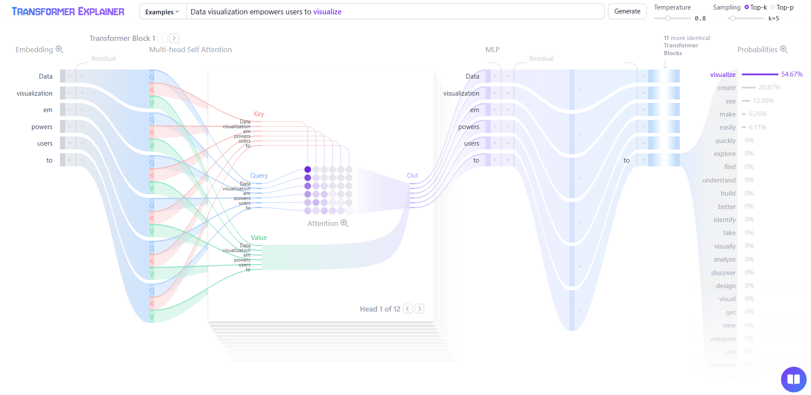

# Python GenAI Developer Training

## Other repo
> https://github.com/KirkYagami/ps2-genai-trng

----

## Colab Notebooks:

1. GenAI Basics: https://colab.research.google.com/drive/1hYDYolb7iMcQ9ERCE67LviBaOHbWBYw5?usp=sharing

---

## Transformers

### Suggested Readings (Not in order):
1. https://poloclub.github.io/transformer-explainer/
2. https://medium.com/@amanatulla1606/transformer-architecture-explained-2c49e2257b4c
3. https://www.datacamp.com/tutorial/how-transformers-work

---

## Hugging Face
### Suggested Readings (Not in order):
1. YT Tutorials:
    - https://youtu.be/QEaBAZQCtwE
    - https://www.youtube.com/watch?v=3kRB2TXewus

---

## Prompt Engg
### Suggested Readings (Not in order):

1. System Message:
- https://www.prompthub.us/blog/everything-system-messages-how-to-use-them-real-world-experiments-prompt-injection-protectors
- https://medium.com/data-science-in-your-pocket/claudes-system-prompt-explained-d9b7989c38a3

---

## RAG

### Suggested Readings (Not in order):

- Langchain Rag Tutorial: https://medium.com/@dminhk/retrieval-augmented-generation-rag-explained-b1dd89979681

- https://www.datacamp.com/blog/what-is-retrieval-augmented-generation-rag

---

## Vector Databases:
### Suggested Readings (Not in order):

1. https://www.tigerdata.com/learn/postgresql-extensions-pgvector

### ChromaDB
1. https://docs.trychroma.com/docs/querying-collections/query-and-get
2. https://docs.trychroma.com/docs/querying-collections/full-text-search

---

## LangChain:
### Suggested Readings (Not in order):

#### Prompt Template
1. https://medium.com/@shravankoninti/different-prompt-templates-using-langchain-3c8dd3aca3be

#### Structured Output
1. https://python.langchain.com/docs/concepts/structured_outputs/
2. https://medium.com/@juanc.olamendy/parsing-llm-structured-outputs-in-langchain-a-comprehensive-guide-f05ffa88261f

#### Agents intro

1. https://readmedium.com/en/https:/medium.com/@prabhakaran_arivalagan/behind-the-scene-react-agents-in-langchain-4f7f48c2476d
2. https://medium.com/@laylabitar321/unlock-the-power-of-react-based-langchain-agents-a-beginners-guide-62c8fc58c3c8
 

## LangGraph:
### Suggested Readings (Not in order):

1. https://freedium.cfd/https://generativeai.pub/langgraph-tutorials-part-1-89e6a5adace9
2. https://generativeai.pub/langgraph-tutorials-part-2-df5314593d6b
3. https://freedium.cfd/https://medium.com/@kbdhunga/implementing-human-in-the-loop-with-langgraph-ccfde023385c
4. https://langchain-ai.github.io/langgraph/tutorials/get-started/4-human-in-the-loop/

---

Made with ❤️ by Nikhil Sharma

